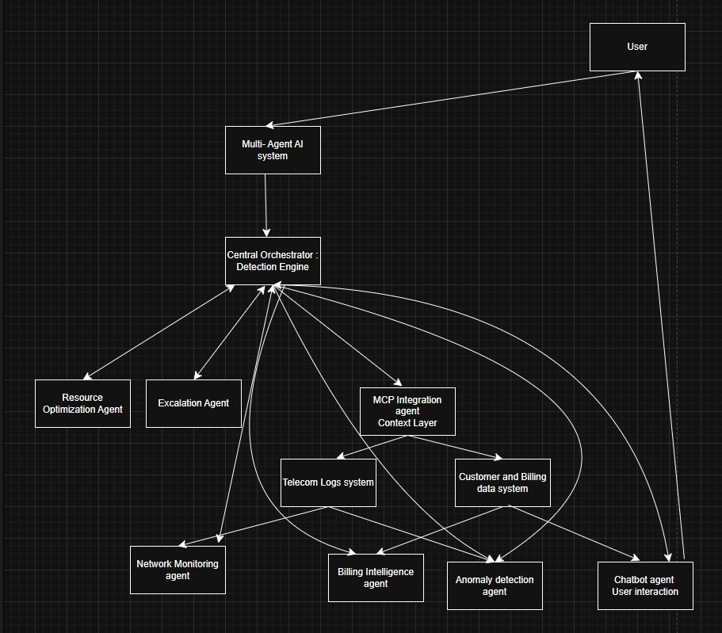
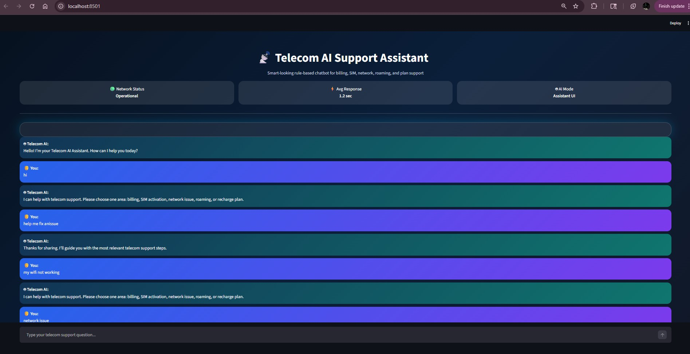

# Multi-Agent AI System for Intelligent Telecom Operations

A production-style **multi-agent AI system** designed to simulate intelligent telecom operations using autonomous agents, shared context, and real-time decision workflows.

This system demonstrates how modern telecom platforms can leverage **collaborative AI agents + context protocols (MCP)** to handle customer support, network monitoring, anomaly detection, billing intelligence, and operational optimization at scale.

---

##  Overview

Telecom environments are highly dynamic with continuous network events, large-scale user interactions, and mission-critical service requirements.

This system models how **distributed AI agents** can:

* Automate telecom workflows
* Perform intelligent routing of user queries
* Enable context-aware decision making
* Reduce operational overhead
* Improve customer experience through faster resolution

---

##  System Architecture



---

##  Core Agents

###  Orchestrator (Decision Engine)

* Performs intent detection
* Routes tasks to relevant agents
* Coordinates multi-agent workflows
* Aggregates responses

---

### Chatbot Agent

* Handles user interaction
* Interprets telecom queries
* Delegates tasks to orchestrator
* Returns final responses

 


### Network Monitoring Agent

* Simulates network diagnostics
* Detects signal and connectivity issues
* Identifies outage patterns
* Provides troubleshooting steps

---

###  Billing Intelligence Agent

* Handles billing and payment queries
* Explains invoices and usage spikes
* Suggests plans and optimizations
* Flags disputes

---

###  Anomaly Detection Agent

* Detects abnormal patterns in usage/network
* Identifies repeated failures
* Flags potential disruptions
* Triggers alerts

---

###  Resource Optimization Agent

* Simulates bandwidth allocation
* Suggests load balancing strategies
* Improves network efficiency
* Supports scaling decisions

---

###  Escalation Agent

* Handles unresolved or critical issues
* Simulates ticket creation workflows
* Prioritizes urgent requests
* Routes to human support

---

## MCP Integration Agent (Context Layer)

The system includes a dedicated **MCP (Model Context Protocol) Agent** that enables seamless integration with multiple backend systems.

### 🧠 Role of MCP Agent

* Fetches real-time contextual data
* Maintains shared context across agents
* Normalizes and structures data
* Enables cross-agent reasoning
* Reduces redundant queries

---

## 🔗 Connected Systems

###  Telecom Logs System

* Network logs and historical incidents
* Outage patterns and diagnostics data
* Used by Network + Anomaly Agents

---

###  Customer & Billing System

* User plans and billing history
* Payment and recharge details
* Used by Billing + Chatbot Agents

---

##  End-to-End Workflow

```text
User submits query
        ↓
Chatbot Agent processes input
        ↓
Orchestrator determines intent
        ↓
MCP Agent fetches relevant context
        ↓
Relevant agents activated
        ↓
Agents process request collaboratively
        ↓
Response aggregated and returned
        ↓
Escalation triggered if unresolved
```

---

##  Key Capabilities

* Multi-agent collaboration
* Context-aware decision making (MCP)
* Intelligent query routing
* Telecom-specific workflows
* Modular and scalable architecture
* Real-time interaction simulation
* AI-style conversational interface

---

##  Example Scenarios

###  Network Issue

**Input:** "My internet is very slow"

* Routed to: Network + Anomaly Agent
* MCP fetches logs → detects congestion pattern
* Output: Troubleshooting + issue explanation

---

###  Billing Issue

**Input:** "Why is my bill higher this month?"

* Routed to: Billing Agent
* MCP fetches usage data
* Output: Detailed billing explanation

---

###  Complaint

**Input:** "I want to raise a complaint"

* Routed to: Escalation Agent
* Output: Priority handling + next steps

---

##  Use Cases

* Telecom customer support automation
* Network operations intelligence
* AI-driven workflow orchestration
* Incident detection and escalation
* Enterprise AI system design

---

##  Tech Stack

* Python
* Modular multi-agent architecture
* Context protocol integration (MCP)
* Event-driven workflow design
* Scalable backend-oriented design

---

##  Project Structure

```text
multi-agent-telecom-ai/
│
├── app.py
├── orchestrator.py
├── agents/
│   ├── chatbot_agent.py
│   ├── network_agent.py
│   ├── billing_agent.py
│   ├── anomaly_agent.py
│   ├── optimization_agent.py
│   ├── escalation_agent.py
│   └── mcp_agent.py
│
├── services/
│   ├── telecom_logs.py
│   └── customer_data.py
│
├── README.md
└── requirements.txt
```

---

## Future Enhancements

* Add specialized LLM agents for billing, SIM/eSIM, roaming, network diagnostics, and plan recommendations
* Implement MCP-based shared memory so agents can preserve customer context across workflows
* Enable agent-to-agent task delegation for complex telecom support cases
* Integrate real-time telecom APIs for outage checks, payment status, plan eligibility, and device provisioning
* Add Kafka-based event streaming for live network alerts and support notifications
* Use vector-based retrieval so agents can search telecom policies, FAQs, invoices, and troubleshooting guides
* Add an Escalation Agent that creates tickets when confidence is low or human review is required
* Build predictive agents for network congestion, churn risk, payment failure, and service degradation
---

##  Author

**Ayantika Nandi**
AI Systems | Data Science | Backend Engineering

---

## 📌 Summary

This project demonstrates how **multi-agent AI systems combined with context protocols (MCP)** can model real-world telecom operations, enabling scalable, intelligent, and autonomous decision-making systems.
